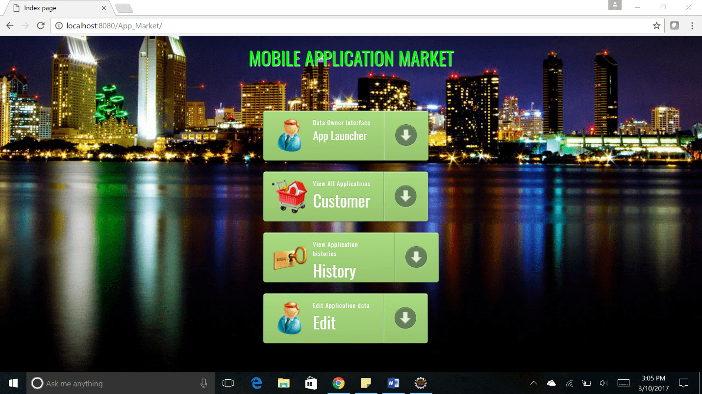
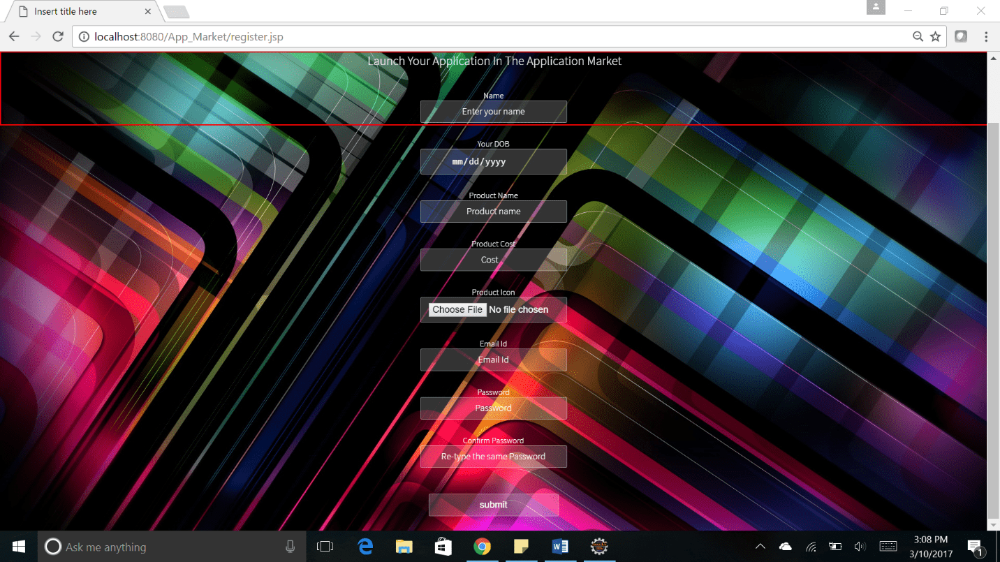
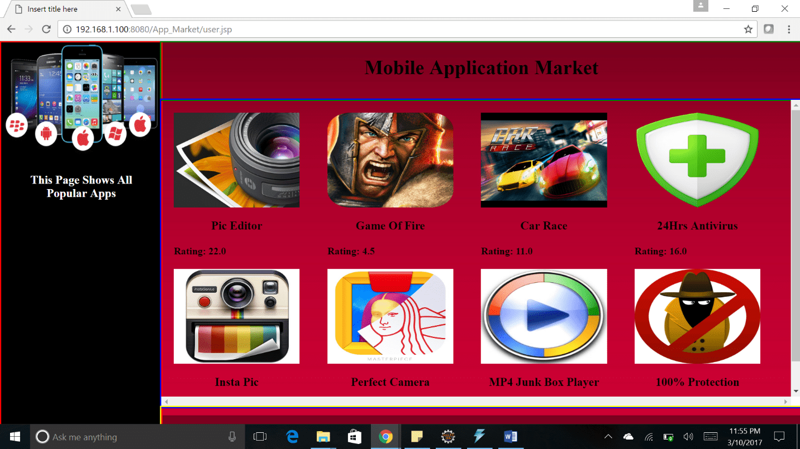
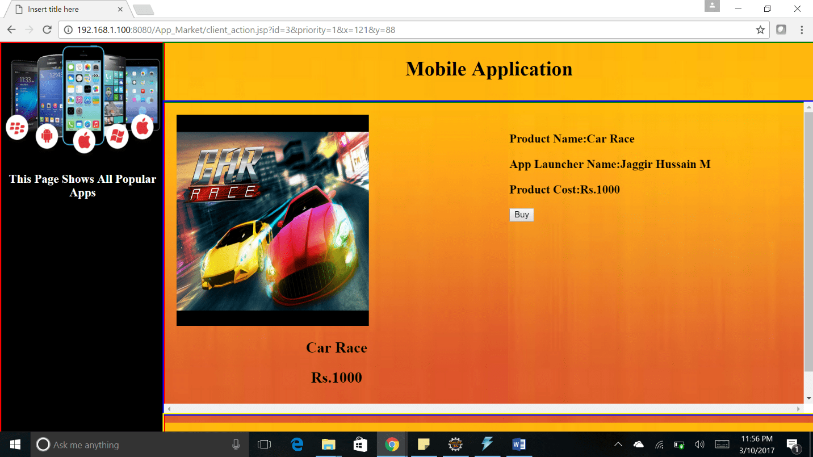
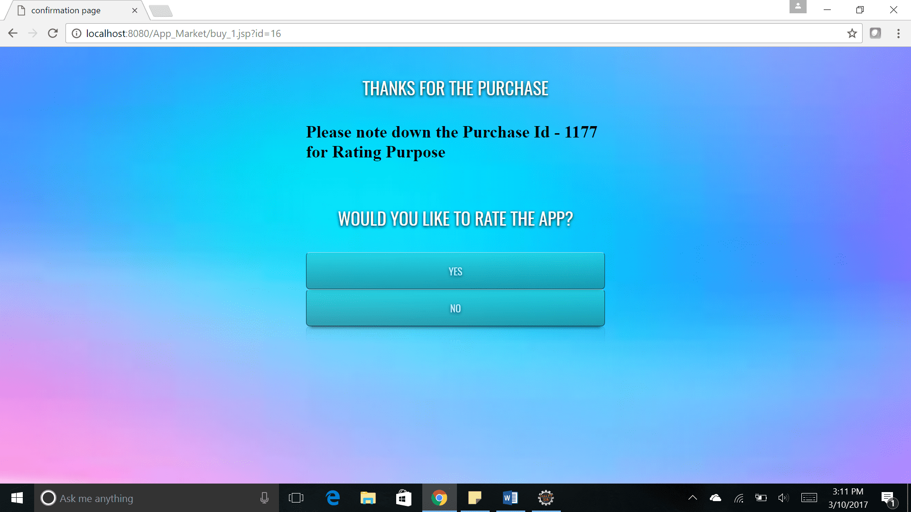
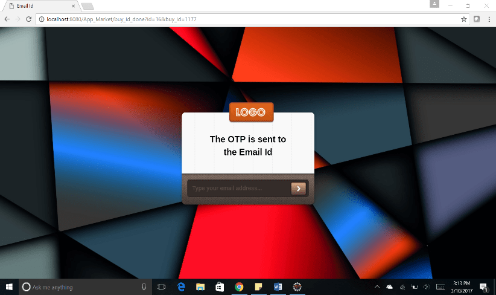
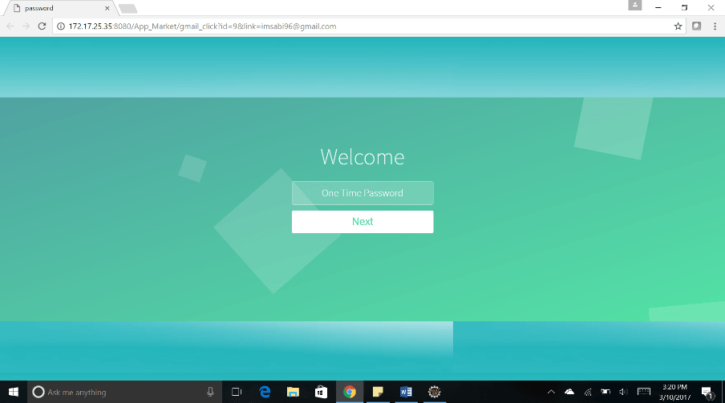
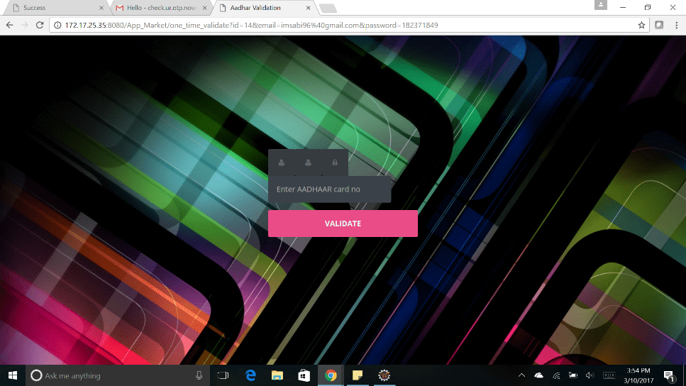
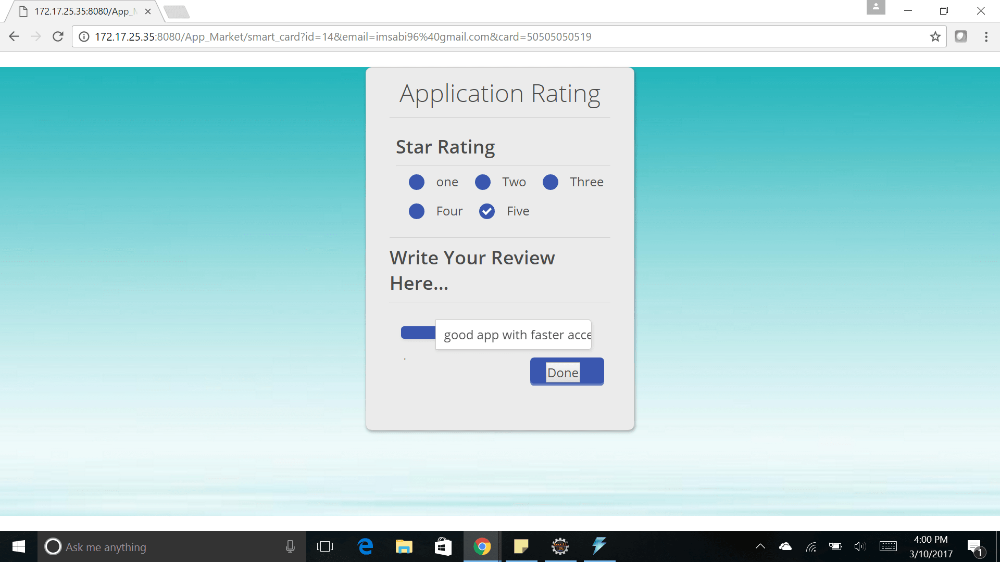
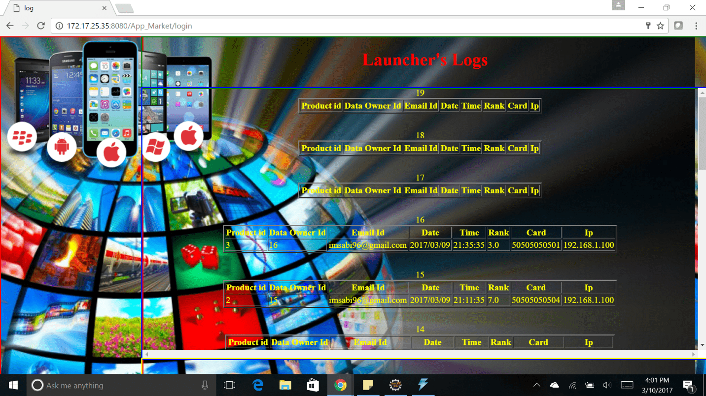

# FRAUD RANKING REDUCTION IN APP MARKET

> This Project avoids Fraud Ranking and Reviews in an App Market and thereby reducing the possibility of counterfeit apps appearing in the top popularity lists, built using Java, JSP, MySQL, HTML5, CSS3, JavaScript <

## Table of contents
* [Technologies](#technologies)
* [Screenshots](#screenshots)
* [Contact](#contact)

## Technologies
* Technologies - HTML5, CSS3,  Bootstrap, JavaScript, Java, JSP, MySQL

## Screenshots
 

## Contact
[Sabiha Begum Jaggir Hussain](https://sabihabegumj.com/) - feel free to contact me!
